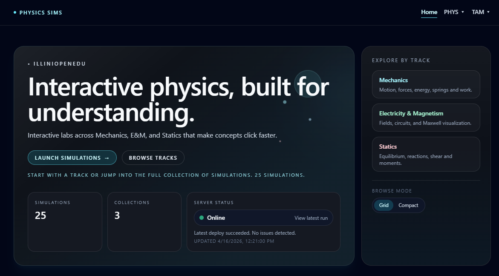
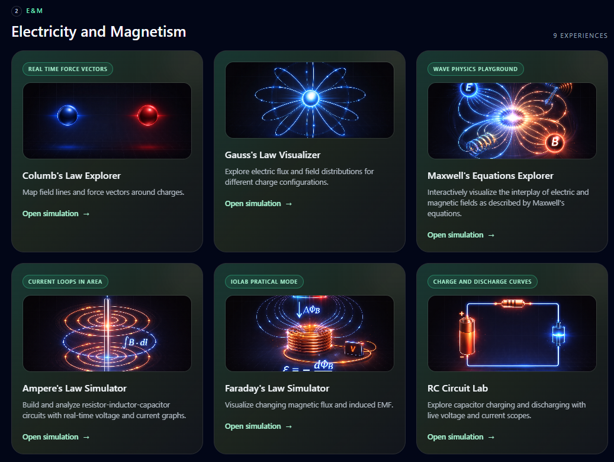

  
  <h3 align="center" style="color: #333;">Physics Sims</h3>

 
 
 

---

Interactive, browser-native physics simulations built with React + TypeScript.

PhysicsSims is designed for students who want to see the math happen: tweak parameters, watch behavior change instantly, and build intuition for mechanics, E&M, and statics.

## Documentation

This README stays intentionally short. Full project docs now live in the [wiki](https://github.com/IlliniOpenEdu/PhysicsSims/wiki):

- [Wiki Home](wiki/Home)
- [Development Setup](wiki/Development)
- [Simulation Catalog](wiki/Simulations)
- [Deployment](wiki/Deployment)
- [Contributing](wiki/Contributing)

## Preview

  
  

<!-- ## Acknowledgements

This project is developed by the University of Illinois Open Education Initiative, with support from the University of Illinois Urbana-Champaign and the Grainger College of Engineering Physics Department. -->

## License

This project is licensed under the MIT License. See the [LICENSE](LICENSE) file for details.
