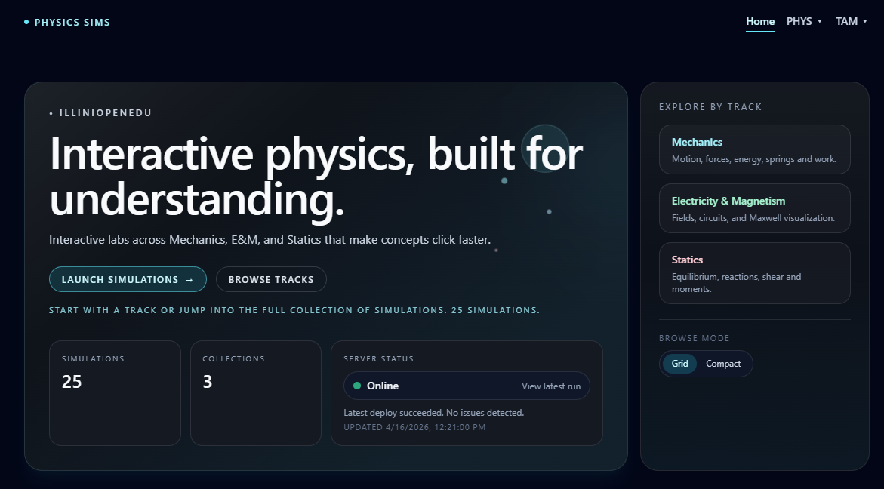
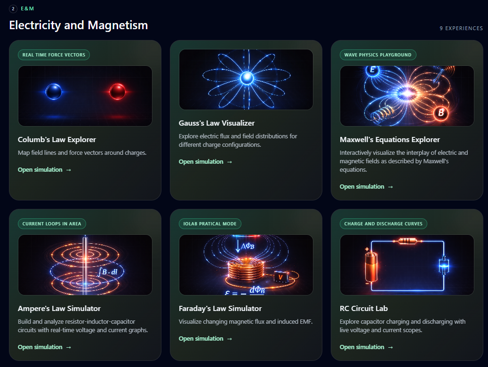

<p align="center">
  
</p>

<p align="center">
  <a href="https://www.repostatus.org/#active"></a>
  <a href="https://github.com/IlliniOpenEdu/PhysicsSims/actions/workflows/deploy.yml"></a>
  <a href="https://github.com/IlliniOpenEdu/PhysicsSims/blob/main/LICENSE"></a>
  
  <a href="https://github.com/IlliniOpenEdu/PhysicsSims/wiki"></a>
</p>

<p align="center">
  <strong>Interactive, browser-native physics simulations for PHYS 211 · 212 and beyond.</strong><br>
  Tweak parameters, watch behavior change in real time, and build physical intuition — no installs, no accounts.
</p>

<p align="center">
  <a href="https://physicssims.illiniopenedu.org"><strong>→ Open the app</strong></a>
</p>

---

<p align="center">
  
  
</p>

---

## Overview

PhysicsSims is an open-source suite of interactive simulations built by students for students at the University of Illinois. Every simulation runs entirely in the browser — nothing to install — and is designed to complement UIUC's PHYS 211 (Classical Mechanics), PHYS 212 (Electromagnetism), and adjacent courses.

Each module lets you manipulate real physics parameters (mass, charge, voltage, frequency, …) and observe the mathematical relationships play out visually in real time.

---

## Simulation Catalog

### Mechanics — PHYS 211

| Simulation | Topics Covered |
|---|---|
| Kinematics (1D & 2D) | Position, velocity, acceleration |
| Forces & Free Body Diagram | Newton's laws, normal/friction forces |
| Gravity & Friction | Incline dynamics, coefficient of friction |
| Box on Incline | Decomposed forces, angle sweeps |
| Spring Force & Spring Energy | Hooke's law, elastic potential energy |
| Pulley System | Tension, mechanical advantage |
| Energy Hills | Conservation of energy, potential wells |
| Work in Dynamics | Work-energy theorem |
| Center of Mass | Multi-body systems |
| Impulse Builder | Impulse-momentum theorem |
| Momentum Collisions (1D & 2D) | Elastic & inelastic collisions |
| Orbital Motion | Gravitational orbits, Kepler's laws |
| Rotational Dynamics | Torque, angular momentum, moment of inertia |
| Oscillations | Vertical spring, pendulum, wave generator, standing waves, frequency generator |
| Fluids & Pressure | Buoyancy, ideal gas law, fluid flow, Bernoulli's principle |

### Electromagnetism — PHYS 212

| Simulation | Topics Covered |
|---|---|
| Coulomb's Law | Point-charge force fields |
| Gauss's Law | Flux and enclosed charge |
| Capacitor | Plate geometry, dielectrics, stored energy |
| RC Circuit | Charging/discharging transients |
| Ampere's Law | Current-carrying conductors, field loops |
| Faraday's Law | Electromagnetic induction |
| Magnetic Field (2D & 3D) | Biot-Savart, field visualization |
| Maxwell's Equations | Unified field relationships |
| LHC Collider | Relativistic particle physics |
| 3D Wave Equation | Propagating E & B field vectors |
| Optics | Reflection, refraction, lenses |
| Universal Circuit Builder | R, L, C component sandbox |

### Statics & Thermodynamics

| Simulation | Topics Covered |
|---|---|
| Beam Balance | Torque equilibrium, distributed loads |
| Distributed Load | Shear and moment diagrams |
| Heat Transfer | Conduction, convection, radiation |

---

## Tech Stack

| Layer | Technology |
|---|---|
| UI Framework | [React 18](https://react.dev) + [TypeScript](https://www.typescriptlang.org) |
| Build & Dev Server | [Vite 7](https://vite.dev) |
| Routing | [React Router 7](https://reactrouter.com) |
| 3D Rendering | [Three.js](https://threejs.org) via [@react-three/fiber](https://docs.pmnd.rs/react-three-fiber) + [@react-three/drei](https://github.com/pmndrs/drei) |
| Animation | [Framer Motion](https://www.framer.com/motion) + [anime.js](https://animejs.com) |
| Styling | [Tailwind CSS 3](https://tailwindcss.com) |
| Deployment | GitHub Pages via [gh-pages](https://github.com/tschaub/gh-pages) |


## Code Agents
| Agent | Role |
|---|---|
| Codex GPT-5.5 | Initial architecture planning and project scaffolding |
| Claude Code | Core development, iterative feature implementation, and documentation |
| Claude Opus 4.8 | Architectural code review and refactoring analysis |
| DALL-E 3 | Simulation thumbnail and visual asset generation |
| Ruflo Agent Swarm | Multi-agent debugging and complex feature coordination |
| GitHub Copilot | Inline code suggestions and error resolution |
| Cursor | Code editing, navigation, and context-aware completions |

> ### AI Usage Disclaimer
> AI agents assisted us in accelerating development and handling routine implementation tasks, but all final code was reviewed, edited, and approved by human developers. All architectural decisions and quality standards were maintained by the team. Simulation thumbnails and visual assets were AI-generated; as engineers rather than artists, we made a deliberate choice to use generative tools for visual production while keeping all technical and creative direction human-led. However, many other aspects of the project were entirely human-driven, including core architecture,physics logic implementation, UI design, and documentation. We view AI as a powerful tool to augment human creativity and productivity, but not a replacement for human judgment, expertise, or oversight. All code was thoroughly reviewed and tested by our team to ensure quality and correctness.
>
> Many projects leverage AI in their development process without disclosing it. We believe transparency about our tooling is owed to our users and the broader open-source community — so that the work can be understood and evaluated accurately.

---

## Getting Started

### Prerequisites

- **Node.js** ≥ 20
- **npm** ≥ 10

### Install & run locally

```bash
git clone https://github.com/IlliniOpenEdu/PhysicsSims.git
cd PhysicsSims
npm ci --ignore-scripts
npm run dev
```

The dev server starts at **http://localhost:5173/PhysicsSims/**.

### Other commands

```bash
npm run build      # Type-check + production build → dist/
npm run preview    # Preview the production build locally
npm run lint       # ESLint on src/ (ts, tsx)
npm run deploy     # Build and push dist/ to the gh-pages branch
npm run gen:module-params  # Generate TypeScript module parameter types
```

---

## Project Structure

```
src/
├── App.tsx                   # Root component: routing, navbar, footer, analytics
├── Home.tsx                  # Landing page
├── pages/
│   ├── mechanics/            # PHYS 211 simulation pages
│   ├── enm/                  # PHYS 212 simulation pages
│   ├── statics/              # TAM211 simulation pages
│   ├── thermo/               # PHYS 213 simulation pages
│   └── system/               # Website info pages 
├── components/               # Shared UI components and simulation renderers
├── hooks/                    # Custom hooks (URL state, animation, tweened values)
├── lib/                      # Pure physics/math logic (no React)
└── config/                   # Admin panel, feature flags, module params
```

Every simulation follows the same pattern: a **page component** (`src/pages/`) renders controls and a canvas/SVG; **physics logic** lives in `src/lib/` as pure functions; **custom hooks** in `src/hooks/` bridge the two.

---

## Contributing

Contributions are welcome — new simulations, bug fixes, accessibility improvements, and documentation are all in scope.

1. Fork the repository and create a feature branch.
2. Follow the [Development Setup](https://github.com/IlliniOpenEdu/PhysicsSims/wiki/Development) guide in the wiki.
3. Open a pull request with a clear description of the change and any relevant physics background.

See the full [Contributing Guide](https://github.com/IlliniOpenEdu/PhysicsSims/wiki/Contributing) for coding conventions, adding a new simulation, and the review process.

---

## Documentation

Full project documentation lives in the [GitHub Wiki](https://github.com/IlliniOpenEdu/PhysicsSims/wiki):

- [Development Setup](https://github.com/IlliniOpenEdu/PhysicsSims/wiki/Development)
- [Simulation Catalog](https://github.com/IlliniOpenEdu/PhysicsSims/wiki/Simulations)
- [Adding a Simulation](https://github.com/IlliniOpenEdu/PhysicsSims/wiki/Contributing)
- [Deployment](https://github.com/IlliniOpenEdu/PhysicsSims/wiki/Deployment)

---

## License

Distributed under the **MIT License**. See [`LICENSE`](LICENSE) for details.

---

<p align="center">
  Built by students, for students · <a href="https://illiniopenedu.org">IlliniOpenEdu</a> · University of Illinois Urbana-Champaign
</p>
